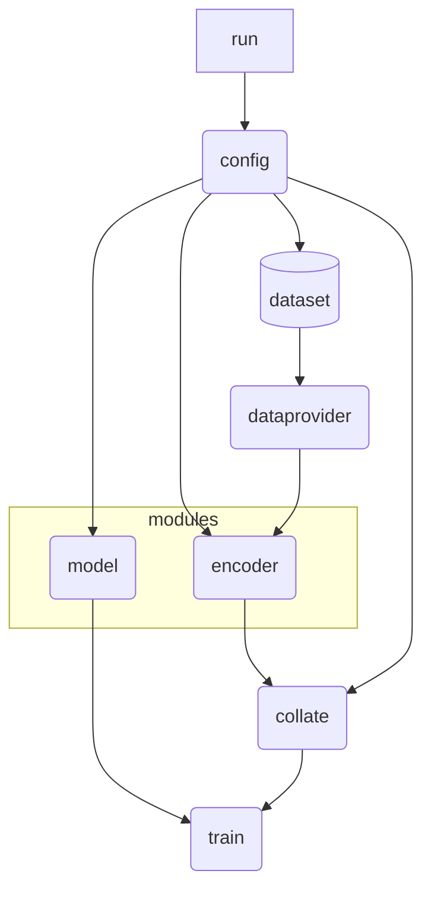

# Train

One config per representation. The filenames use the size words the code was written with; this is
what each one actually is, and the same mapping is published as
`supplementary_data/prepibind_D12_method_key.csv`:

| config | representation | embedding dim | trained parameters |
|---|---|---:|---:|
| `config_esmc_small.py` | ESMC 300M | 960 | 55,820,161 |
| `config_esmc_medium.py` | ESMC 600M | 1152 | 80,365,825 |
| `config_esmc_large.py` | ESMC 6B | 2560 | 396,661,761 |
| `config_esm3_small.py` | ESM3 Small | 1536 | 142,838,785 |
| `config_esm3_medium.py` | ESM3 Medium | 2560 | 396,661,761 |
| `config_esm3_large.py` | ESM3 Large | 6144 | 2,284,204,033 |
| `config_af3.py` | AlphaFold 3 | — | 24,823,041 |
| `config_boltz.py` | Boltz-1 | — | 24,823,041 |
| `config_chai.py` | Chai-1 | — | 48,629,505 |
| `config_blosum.py` | BLOSUM62 baseline | — | 39,450 |
| `config_deepneo.py` | DeepNeo re-implementation | — | — |

`config_esmc_small.py` is the released model's config. The embedding dimension is `hla_dim_s` /
`epi_dim_s` in each file; the structure backends read side-chain stores, whose width depends on the
pair reduction.

## Workflow


## How to run
- Set the configuration in the `config.py` file.
    - For default, `config.py`' imports the `model.py` and `encoder.py` files located in the `code` directory.'
    - You can import your own `model.py` and `encoder.py` files just simply locating them in your working directory, or chainging the import path in the `config.py` file.
- You can run the code by running the `run.ipynb` or `run.sh` file.
    - If you want to run the code in the terminal, you can run the `run.sh` file by typing `bash run.sh` in the terminal.
    - If you want to run the code in the jupyter notebook, you can run the `run.ipynb` file by running the cells in the jupyter notebook.
    - You can also run the code in the terminal by running train.py file.
```bash
# Run the code in the terminal
python $CODE_PATH/train.py $CONFIG_PATH
```
```python
# Run the code in the jupyter notebook
from prepibind.train import main as train
train('Path of the config file')
```

### Description of Selected Arguments in `config.py`
| Arguemnt | Description |
| --- | --- |
| model | Select specific class in `model.py` |
| encoder | Select specific class in `encoder.py` |
| epi_args | Arguments for epitope dataset. You can set the header name of epitope sequence, HLA name, and target in the dataset file. Specific sperator should be set according to the dataset file. (e.g. `,` or `\t`) |
| regularize | If the model has a regularization method, set it to True. (e.g. `model.DeepNeo`) |